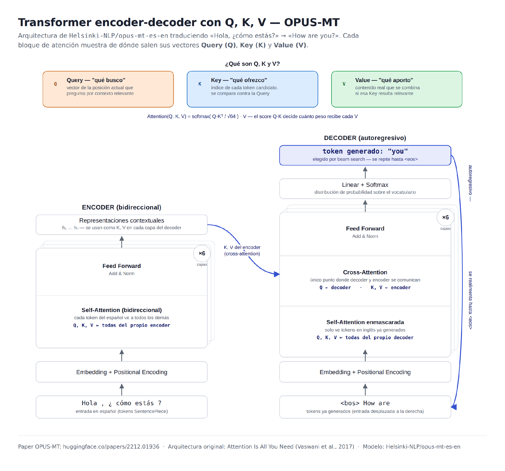
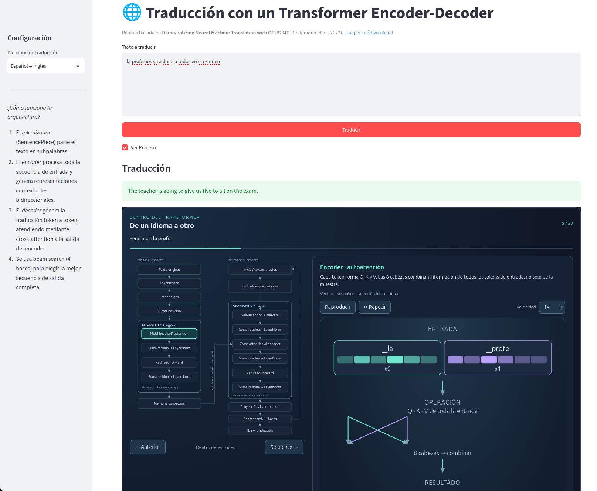
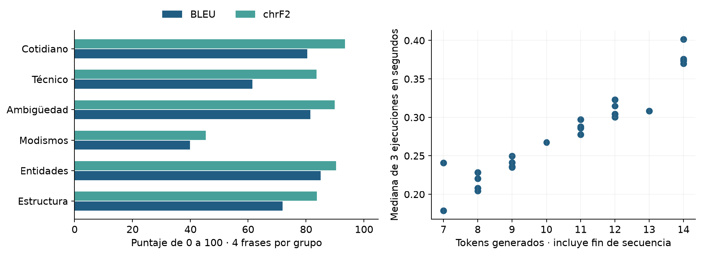
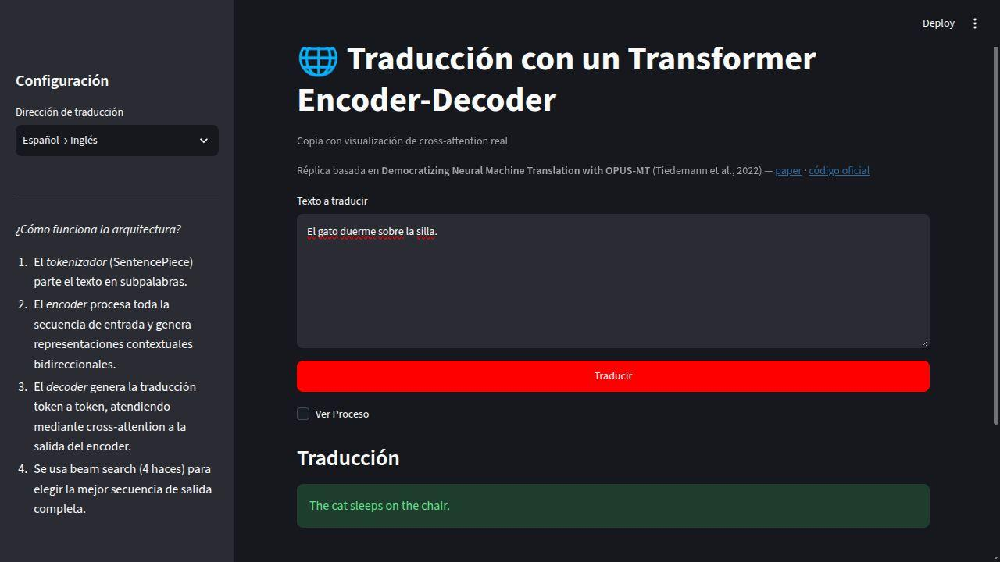
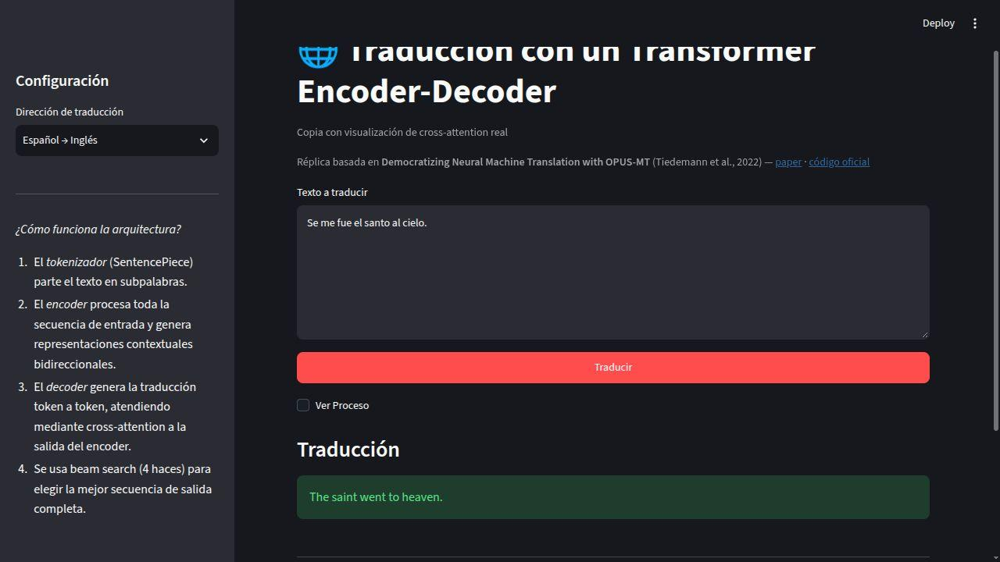
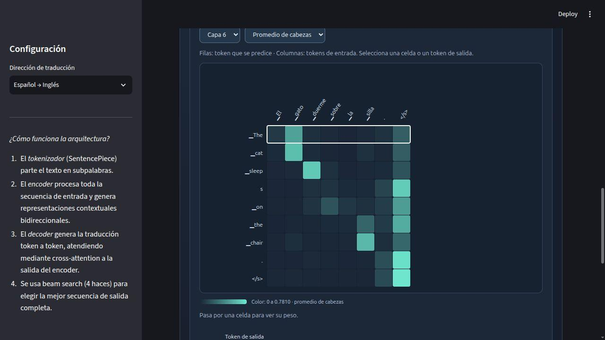
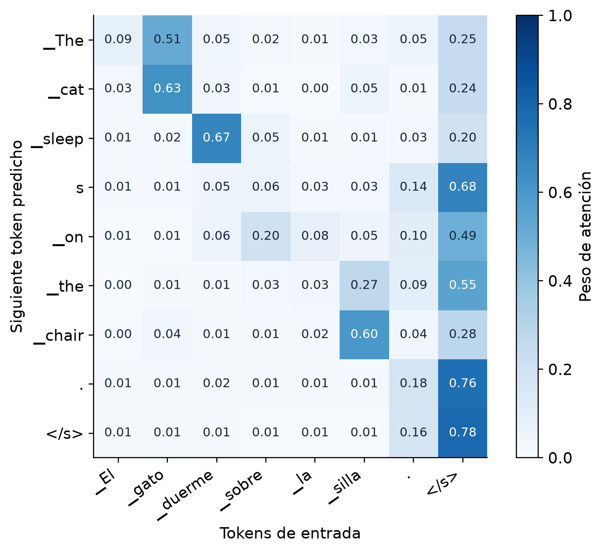

# PROCESAMIENTO DE DATOS SECUENCIALES

## PROYECTO FINAL

## Traducción automática español-inglés con OPUS-MT: arquitectura Transformer encoder-decoder

Implementación del proceso de inferencia sobre el checkpoint preentrenado Helsinki-NLP/opus-mt-es-en, con interfaz interactiva en Streamlit.

Integrantes:

Alejandro Meneses, Henry Alfredo Rosentiehl, Marko David García

Repositorio de GitHub del grupo:

[proyecto_secuenciales](https://github.com/almeneses/proyecto_secuenciales)

## 1. Resumen (Abstract)

Este trabajo analiza el artículo Democratizing Neural Machine Translation with OPUS-MT y su relación con una aplicación de traducción entre español e inglés. El objetivo es entender cómo el texto se convierte en tensores, cómo interactúan el encoder y el decoder, y cómo el modelo construye una traducción. La implementación utiliza modelos Marian preentrenados, cargados mediante Hugging Face Transformers, y una interfaz en Streamlit. Además, una versión del proyecto permite explorar la cross-attention calculada sobre la traducción seleccionada.

La evaluación propia se realizó en la dirección español a inglés con 24 frases y una referencia por frase. Se obtuvo BLEU de 70,99 y chrF2 de 82,61. La mediana de latencia fue de 0,287 segundos en CPU, con tres ejecuciones por entrada y el modelo previamente cargado, también se capturaron los tensores Q, K y V de una capa real, y se reconstruyó su matriz de atención para verificar la explicación matemática. El modelo resolvió varios casos de contexto y ambigüedad pero presentó errores en un modismo y en la conservación de un nombre de archivo. Estos resultados respaldan el funcionamiento de la aplicación y da algunos indicios de sus limitaciones aunque la muestra no permite generalizar su calidad. No se realizó entrenamiento desde cero ni una reproducción completa de los experimentos del artículo.

## 2. Introducción

### Artículo base y repositorio original

El artículo base de este treabajo es Democratizing Neural Machine Translation with OPUS-MT, de Jörg Tiedemann et al [\[1\]](#ref-1). Se trabaja con la versión arXiv 2212.01936v3, el repositorio oficial de entrenamiento es Helsinki-NLP/OPUS-MT-train [\[2\]](#ref-2) y en este se encuentran los pasos de preparación de datos, entrenamiento, evaluación y publicación de modelos. El código de nuestra aplicación se encuentra en proyecto\_secuenciales [\[3\]](#ref-3). Los enlaces de las referencias permiten consultar cada recurso.

Conviene ubicar cada pieza desde el comienzo. OPUS reúne corpus paralelos. OPUS-MT aprovecha esos datos y publica modelos y herramientas de traducción. Marian es el framework utilizado para entrenar numerosos modelos del proyecto. Transformers permite cargar una implementación compatible en Python. Streamlit presenta la entrada, la traducción y la explicación del proceso. Son componentes relacionados, pero cumplen funciones distintas.

### Contexto del problema

La traducción automática es una de las tareas clásicas de procesamiento de datos secuenciales. Tanto la entrada como la salida son secuencias de longitud variable (oraciones), y no existe una correspondencia uno a uno entre las posiciones de ambas secuencias, una oración de 5 palabras en español puede traducirse en una de 4 o 7 palabras en inglés. Antes de los Transformers, los modelos secuencia a secuencia se basaban en redes recurrentes (RNN/LSTM) que procesaban el texto de forma estrictamente secuencial, lo cual limitaba el paralelismo durante el entrenamiento y dificulta capturar dependencias entre palabras alejadas dentro de la oración. En este sentido, la elección de una traducción depende tanto del contexto como del orden y de expresiones que no mantienen su significado al traducirse literalmente. En español, banco puede referirse a una entidad financiera o a un asiento y un sistema necesita relacionar esa palabra con las demás para decidir entre bank y bench.

### Motivación

Si bien existen modelos de traducción masivamente multilingües, muchos pares de idiomas, en particular los de bajos recursos, quedan poco atendidos por los sistemas gigantes. OPUS-MT propone una alternativa, en vez de un único modelo multilingüe enorme, entrena miles de modelos pequeños y abiertos, uno por cada par (o grupo) de idiomas, usando el corpus público OPUS. Esto permite ofrecer traducción de calidad razonable, con pesos y código abiertos, para una cantidad de pares de idiomas mucho mayor que la que cubren los sistemas comerciales tradicionales.

La motivación práctica es pasar de una aplicación que simplemente devuelve texto a una implementación cuyo comportamiento podamos explicar. Nos interesa saber qué entra al modelo, qué representan sus tensores y qué evidencia ofrecen las visualizaciones. Una animación ayuda a seguir el flujo, pero solo una captura numérica permite afirmar qué atención calculó el modelo para una entrada concreta.

### Objetivo del trabajo

El objetivo es implementar el proceso de inferencia de la arquitectura encoder-decoder de OPUS-MT sobre el checkpoint preentrenado español-inglés, comprender en profundidad sus entradas, salidas, mecanismo de atención y tensores Q, K y V, e implementar una interfaz interactiva en Streamlit que permita cargar texto en español y visualizar la traducción generada por el modelo.

## 3. Marco teórico

### 3.1 Arquitectura Transformer utilizada

OPUS-MT utiliza la arquitectura Transformer encoder-decoder estándar propuesta por Vaswani et al. (2017) [\[4\]](#ref-4), sin modificaciones estructurales mayores. El checkpoint es-en tiene un encoder de 6 capas y un decoder de 6 capas, con d<sub>model</sub>= 512, 8 cabezas de atención por capa y una red feed-forward interna de 2.048 neuronas en cada capa, en total suma aproximadamente 77 millones de parámetros. El vocabulario combinado (español + inglés) tiene 65.001 subpalabras, tokenizadas con SentencePiece (32.000 por idioma).

- Encoder (bidireccional): Procesa toda la oración en español de una sola vez. Cada token puede atender a cualquier otro token de la oración, sin restricción de orden.

- Decoder (autoregresivo): Genera la oración en inglés un token a la vez, su self-attention está enmascarada para que un token nunca pueda ver tokens que todavía no se han generado.

- Cross-attention: En cada capa del decoder, el modelo consulta las representaciones ya calculadas por el encoder, es el único punto de comunicación entre las dos mitades de la red.

### 3.2 Datos de entrenamiento del modelo base

El corpus proviene de OPUS, un repositorio abierto que agrega textos paralelos de fuentes muy diversas: subtítulos de películas y series (OpenSubtitles), documentos legales y parlamentarios de la Unión Europea (Europarl, JRC-Acquis), software localizado (GNOME, Ubuntu), la Biblia, sitios de noticias, documentación técnica y la base colaborativa de frases traducidas Tatoeba, entre otras. Estas fuentes se alinean automáticamente a nivel de oración para cada par de idiomas.

En total, OPUS cubre más de 600 idiomas y más de 40.000 pares de idiomas, con cerca de 20.000 millones de oraciones alineadas. Para el par es-en específicamente, el texto se tokeniza con SentencePiece (32.000 subpalabras por idioma, 65.001 en conjunto), y los pares se organizan en conjuntos de entrenamiento, validación y prueba siguiendo el benchmark Tatoeba Translation Challenge. En lugar de entrenar un único modelo multilingüe gigante, OPUS-MT usa este corpus para entrenar miles de modelos pequeños especializados por par de idiomas, con el motor Marian NMT.

### 3.3 Mecanismo de atención y generación de los tensores Q, K, V

Query (Q), Key (K) y Value (V) son tres proyecciones lineales distintas del mismo vector de entrada (Q = xWq, K = xWₖ, V = xWᵥ, con matrices Wq, Wₖ, Wᵥ aprendidas durante el entrenamiento). Se podría pensar como un sistema de un sistema de búsqueda: la Query es “qué estoy buscando” desde la posición actual, la Key es “cómo se anuncia” cada token disponible, y el Value es el contenido real que aporta ese token si resulta relevante. El score de atención (Q·K) decide cuánto peso recibe cada Value en la combinación final: Attention(Q,K,V) = softmax(Q·Kᵀ/√64)·V, con 64 = 512/8 dimensiones por cabeza.

Lo particular de este modelo es que Q, K y V se calculan sobre vectores distintos según el tipo de atención:

| Tipo de atención | De dónde salen Q / K,V | Qué resuelve en este problema |
| --- | --- | --- |
| Self-attention del encoder | Q, K, V ← oración en español | Contexto entre palabras del español (bidireccional) |
| Self-attention del decoder | Q, K, V ← inglés ya generado | Coherencia con lo ya traducido (solo pasado, autoregresivo) |
| Cross-attention | Q ← decoder · K, V ← encoder | Alinear cada palabra en inglés con la(s) palabra(s) en español relevantes |



Figura 1. Esquema propio de la arquitectura. La memoria del encoder aporta K y V a cada capa de cross-attention. El decoder aporta Q desde su estado actual.

#### Entrada del decoder: Entrenamiento vs. Inferencia

Durante el entrenamiento ya se conoce la traducción correcta completa, así que se le da al decoder esa secuencia objetivo “desplazada a la derecha” (con un token de inicio \<bos\> al comienzo), y se compara su salida contra la secuencia real para calcular la pérdida, gracias al enmascaramiento causal, todas las posiciones se procesan en un solo paso, en paralelo. Durante la inferencia (generación autoregresiva), no existe una traducción objetivo de antemano, el decoder arranca solo con \<bos\>, genera un primer token, y ese token se agrega a su propia entrada para predecir el siguiente, y así sucesivamente hasta producir \<eos\>. Es decir, en inferencia el decoder se alimenta paso a paso de sus propias predicciones anteriores mientras que en entrenamiento se alimenta de la secuencia objetivo real conocida.

### 3.4 Innovaciones del modelo frente a trabajos previos

- Eficiencia sobre escala: En vez de un modelo multilingüe gigante, OPUS-MT entrena miles de modelos chicos (~77M parámetros) que corren en CPU sin necesidad de GPU.

- Arquitectura de “libro de texto”: Encoder bidireccional + decoder autoregresivo + cross-attention, lo que la hace ideal para entender datos secuenciales en profundidad.

- Motor propio (Marian NMT, en C++), más liviano y rápido de entrenar/desplegar que frameworks de propósito general.

- Evaluación estandarizada mediante el Tatoeba Translation Challenge, un benchmark multilingüe diseñado para comparar de forma consistente pares de idiomas de bajos recursos, no solo los pares tradicionalmente bien cubiertos.

- Sin embargo, hay una transparencia parcial, el código y los pesos son abiertos, pero el desglose exacto de datos por par de idioma y el hardware de entrenamiento no se publican en detalle.

## 4. Metodología

Se utilizó Python junto con la librería Hugging Face Transformers y PyTorch como backend. Los pesos preentrenados (Helsinki-NLP/opus-mt-es-en) se descargan automáticamente desde Hugging Face Hub la primera vez que se ejecuta la aplicación, no se realizó entrenamiento ni fine-tuning adicional, solo inferencia sobre el modelo ya entrenado por los autores del paper. La interfaz de usuario se construyó con Streamlit, eligiéndolo por su sencillez para levantar una aplicación web interactiva con muy poco código, ideal para el alcance de este proyecto.

| Herramienta | Uso en el proyecto |
| --- | --- |
| Python 3 | Lenguaje base de la implementación |
| Hugging Face Transformers | Carga del tokenizer y el modelo preentrenado (AutoTokenizer, AutoModelForSeq2SeqLM) |
| PyTorch | Backend de cómputo tensorial usado internamente por transformers |
| SentencePiece | Tokenización en subpalabras del texto de entrada y salida |
| Streamlit | Interfaz web interactiva para cargar texto y visualizar la traducción |

## 5. Desarrollo e implementación

### 5.1 Pasos para ejecutar el proyecto

- Clonar el repositorio de GitHub del grupo.

- Crear un entorno virtual e instalar las dependencias: pip install -r requirements.txt.

- Ejecutar la aplicación: streamlit run app.py.

- Escribir o pegar un texto en español en la interfaz y presionar el botón de traducir.

- Opcional: Seleccionar el Checkbox “Ver Proceso” para visualizar el paso a paso de la traducción, presionando en el botón “Siguiente” o “Anterior” para avanzar o retroceder respectivamente.

### 5.2 Carga de los pesos preentrenados

Los pesos se cargan con dos líneas, sin necesidad de descargarlos manualmente ni de definir la arquitectura desde cero:

```python
tokenizer = AutoTokenizer.from_pretrained("Helsinki-NLP/opus-mt-es-en")
model = AutoModelForSeq2SeqLM.from_pretrained("Helsinki-NLP/opus-mt-es-en")
```

from\_pretrained() descarga automáticamente el checkpoint (pesos + configuración + vocabulario SentencePiece) desde Hugging Face Hub la primera vez que se ejecuta, y lo guarda en caché local para ejecuciones posteriores.

### 5.3 Preprocesamiento e inferencia

- Preprocesamiento: El texto en español se tokeniza con SentencePiece y se convierte en input\_ids (índices enteros) más una attention\_mask, internamente el modelo suma el embedding de cada token con su codificación posicional.

- Encoder: Procesa la secuencia de entrada completa una sola vez (bidireccional), produciendo un conjunto de representaciones contextuales que se reutilizan como K y V en cada capa del decoder.

- Decoder: Genera la traducción token por token de forma autoregresiva mediante model.generate(), usando beam search (búsqueda de la secuencia completa más probable, no solo el token más probable en cada paso) hasta producir el token de fin de secuencia \<eos\> o alcanzar la longitud máxima configurada.

- Postprocesamiento: los ids generados se decodifican de vuelta a texto en inglés con el mismo tokenizer SentencePiece.

## 6. Resultados y análisis

### 6.1 Ejemplos de traducción

A modo ilustrativo (deben reemplazarse o complementarse con capturas y resultados propios de la ejecución real):

| Entrada (español) | Salida generada (inglés) |
| --- | --- |
| Hola, ¿cómo estás? | How are you? |
| El aprendizaje profundo ha cambiado el procesamiento del lenguaje natural. | Deep learning has changed natural language processing. |
| Buenos días, ¿tienes tiempo para una reunión hoy? | Good morning, do you have time for a meeting today? |

### 6.2 Capturas de pantalla del despliegue

A continuación se muestra la aplicación de Streamlit en funcionamiento (reemplazar por capturas propias de las pruebas realizadas):



### 6.3 Métricas de desempeño reportadas

| Métrica | Qué mide |
| --- | --- |
| BLEU | Coincidencia de n-gramas contra la traducción de referencia |
| chrF / chrF++ | Similaridad a nivel de caracteres, más robusta con morfología rica |
| COMET | Métrica neuronal entrenada para correlacionar con juicio humano |
| MuCoW | Test suite lingüístico para desambiguación léxica |

| Conjunto de evaluación | Resultado |
| --- | --- |
| Tatoeba (test propio del benchmark) | BLEU 59.6 · chrF 0.739 |
| WMT news (2008-2013) | BLEU 27.9-37.9 · chrF 0.553-0.624 |

El BLEU notablemente más alto en Tatoeba (59.6) frente a WMT news (27.9-37.9) se explica por la naturaleza de cada conjunto. Tatoeba está compuesto por oraciones cortas, simples y de dominio general,  muy similares a las de entrenamiento, mientras que WMT news contiene noticias con vocabulario especializado, oraciones largas y estructuras más complejas, un dominio más alejado del corpus de entrenamiento. Esto ilustra un punto importante de generalización. Un mismo modelo puede tener un desempeño muy distinto según qué tan parecido sea el texto de prueba al corpus con el que fue entrenado.

### 6.4 Evaluación propia y análisis de resultados

Se evaluaron 24 frases de español a inglés, organizadas en seis grupos de cuatro ejemplos y con una referencia por frase. Cada entrada se ejecutó tres veces y produjo la misma traducción en las tres repeticiones.

#### Calidad y rendimiento

Las 72 llamadas en CPU, con el modelo cargado, alcanzaron un BLEU de 70,99, un chrF2 de 82,61 y una mediana de latencia de 0,287 segundos. Los intervalos bootstrap describen la variación de esta muestra. La carga y la extracción de atención corresponden a mediciones individuales.

| Medida | Resultado | Interpretación |
| --- | --- | --- |
| Casos evaluados | 24 frases ES→EN | Una referencia por frase |
| BLEU | 70,99 | Coincidencia a nivel de corpus |
| Intervalo bootstrap BLEU | 61,90 a 79,92 | Percentiles 2,5 y 97,5 de 1.000 remuestreos |
| chrF2 | 82,61 | Coincidencia de n-gramas de caracteres |
| Intervalo bootstrap chrF2 | 76,22 a 88,47 | Variación de esta muestra |
| Mediana de latencia | 0,287 s | 72 llamadas con el modelo cargado |
| Percentil 95 de latencia | 0,387 s | Percentil empírico de las 72 llamadas |
| Rendimiento agregado | 37,22 tokens/s | Tokens nuevos, incluido `</s>`, sobre tiempo total |
| Carga desde caché | 2,609 s | Una medición, sin descarga de pesos |
| Extracción de atención | 0,037 s | Una medición para el ejemplo del gato |

Los resultados por grupo permiten identificar diferencias según el tipo de frase.

| Grupo | BLEU | chrF2 | Mediana por frase |
| --- | --- | --- | --- |
| Cotidiano | 80,37 | 93,48 | 0,265 s |
| Técnico | 61,53 | 83,56 | 0,310 s |
| Ambigüedad | 81,48 | 89,96 | 0,225 s |
| Modismos | 39,83 | 45,38 | 0,245 s |
| Entidades | 85,03 | 90,45 | 0,282 s |
| Estructura | 71,83 | 83,72 | 0,373 s |



*Cada punto representa una frase y su mediana de tres ejecuciones. Los puntajes por grupo son exploratorios, pues cada grupo contiene cuatro ejemplos.*

El modelo distinguió sentidos de palabras como banco y vela según el contexto. Los modismos obtuvieron los puntajes más bajos. «Se me fue el santo al cielo» se tradujo literalmente como «The saint went to heaven», mientras que «You're kidding me» fue una alternativa válida para «Me estás tomando el pelo», aunque distinta de la referencia. También cambió `resultados_2026.csv` por `results_2026.csv` y suavizó una prohibición al usar *should not* en lugar de *must not*. Estos casos muestran que la fluidez no garantiza conservar el significado y los detalles.

Las latencias corresponden a frases cortas, sin usuarios concurrentes. No se midieron el uso máximo de memoria ni el rendimiento bajo carga.

#### Capturas propias de las pruebas

Estas capturas del informe muestran una traducción correcta y el fallo observado en un modismo, obtenidos en la versión con cross-attention.



*La entrada «El gato duerme sobre la silla.» produjo «The cat sleeps on the chair.». La captura corresponde a la copia con cross-attention utilizada en las pruebas.*



*«Se me fue el santo al cielo» produjo «The saint went to heaven.». La salida es fluida, pero pierde el significado del modismo.*

#### Atención y verificación de Q, K y V

El explorador y el mapa numérico muestran los mismos pesos de atención para la frase del gato, promediados entre las ocho cabezas de la última capa.



*La interfaz ajusta la escala de color al máximo observado, que fue 0,7810 en este caso.*



*Las filas corresponden al siguiente token predicho. Se conservan los tokens especiales y los pesos originales, con una escala fija de 0 a 1.*

Al predecir *The*, la atención asignó un 51,47 % a *gato* y un 24,76 % a `</s>`. Estos pesos relacionan representaciones con contexto y no equivalencias directas entre palabras. Se capturaron Q, K y V y se reconstruyó la matriz de atención, con una diferencia máxima de 0,0 frente a la devuelta por el modelo en esa ejecución. El error máximo en la suma de las filas fue de 1,79 × 10⁻⁷. La comprobación respalda el cálculo observado, pero no explica por completo la traducción.

#### Verificación funcional y límites

Las pruebas verificaron la normalización y alineación de la atención, el enmascaramiento causal y las 20 escenas de la interfaz. Mostrar u ocultar el proceso conservó la inferencia en caché y un fallo de atención mantuvo la traducción. Se usaron pesos inicializados y datos controlados según la prueba, por lo que estas verificaciones no miden la calidad del checkpoint. Una entrada de 1.051 tokens se recortó a 512 sin aviso, lo que puede presentar una traducción parcial como completa.

#### Relación con los resultados publicados

Como complemento de la sección 6.3, las fichas de los modelos reportan los siguientes resultados externos.

| Modelo y conjunto publicado | BLEU | chrF original |
| --- | --- | --- |
| ES→EN, Tatoeba-test.spa.eng | 59,6 | 0,739 |
| ES→EN, newstest2013-spaeng.spa.eng | 35,3 | 0,609 |
| EN→ES, Tatoeba-test.eng.spa | 54,9 | 0,721 |
| EN→ES, newstest2013-engspa.eng.spa | 35,0 | 0,598 |

El chrF publicado usa una escala de 0 a 1. Cambiar la escala no iguala los protocolos de evaluación. El BLEU propio de 70,99 no demuestra una mejora frente a Tatoeba o WMT, porque se utilizaron otros ejemplos y referencias. Tampoco se evaluó aquí inglés a español. La muestra pequeña y la referencia única limitan las conclusiones, y las diferencias de idioma, equipo y motor impiden comparar directamente la velocidad con la del artículo.

#### Registro de las 24 pruebas

La tabla conserva las entradas, referencias y salidas para revisar los aciertos y errores detrás de las métricas.

<details>
<summary>Ver las 24 traducciones evaluadas</summary>

| ID | Entrada en español | Referencia previa | Salida del modelo |
| --- | --- | --- | --- |
| 1 | El gato duerme sobre la silla. | The cat sleeps on the chair. | The cat sleeps on the chair. |
| 2 | Mañana vamos a visitar a mi abuela. | Tomorrow we are going to visit my grandmother. | Tomorrow we're going to visit my grandmother. |
| 3 | ¿Puedes cerrar la ventana, por favor? | Can you close the window, please? | Can you close the window, please? |
| 4 | No encontré las llaves en la cocina. | I did not find the keys in the kitchen. | I didn't find the keys in the kitchen. |
| 5 | El modelo utiliza ocho cabezas de atención. | The model uses eight attention heads. | The model uses eight heads of attention. |
| 6 | Los datos se dividen en entrenamiento, validación y prueba. | The data is split into training, validation, and test sets. | The data is divided into training, validation and testing. |
| 7 | La red predice el siguiente token a partir del contexto. | The network predicts the next token from the context. | The network predicts the next token from the context. |
| 8 | El servidor devolvió un error al cargar los pesos. | The server returned an error while loading the weights. | The server returned an error when loading the weights. |
| 9 | Me senté en el banco del parque. | I sat on the park bench. | I sat at the park bench. |
| 10 | El banco aprobó el préstamo ayer. | The bank approved the loan yesterday. | The bank approved the loan yesterday. |
| 11 | La vela iluminó la habitación. | The candle lit up the room. | The candle lit up the room. |
| 12 | El viento llenó la vela del barco. | The wind filled the sail of the boat. | The wind filled the sail of the ship. |
| 13 | Me estás tomando el pelo. | You are pulling my leg. | You're kidding me. |
| 14 | Este examen fue pan comido. | This exam was a piece of cake. | This test was a piece of cake. |
| 15 | No hay que tirar la toalla todavía. | We should not throw in the towel yet. | You don't have to throw in the towel yet. |
| 16 | Se me fue el santo al cielo. | I lost my train of thought. | The saint went to heaven. |
| 17 | Alejandro vive en Cali, Colombia. | Alejandro lives in Cali, Colombia. | Alejandro lives in Cali, Colombia. |
| 18 | La reunión empieza a las 3:30 p. m. | The meeting starts at 3:30 p.m. | The meeting starts at 3:30 p.m. |
| 19 | El informe contiene 25 tablas y 8 gráficos. | The report contains 25 tables and 8 charts. | The report contains 25 tables and 8 graphs. |
| 20 | El archivo se llama resultados_2026.csv. | The file is called resultados_2026.csv. | The file is called results_2026.csv. |
| 21 | Aunque estaba lloviendo, salimos a caminar. | Although it was raining, we went for a walk. | Even though it was raining, we went for a walk. |
| 22 | Si hubiera estudiado más, habría aprobado el examen. | If I had studied more, I would have passed the exam. | If I had studied further, I would have passed the test. |
| 23 | La investigadora que presentó el artículo respondió las preguntas. | The researcher who presented the paper answered the questions. | The researcher who presented the article answered the questions. |
| 24 | El sistema no debe eliminar los datos que aún no se han guardado. | The system must not delete data that has not yet been saved. | The system should not delete data that has not yet been saved. |

</details>

## 7. Conclusiones

### Aprendizajes

El desarrollo de este proyecto permitió comprender en profundidad la arquitectura Transformer encoder-decoder, cómo el encoder construye representaciones contextuales bidireccionales, cómo el decoder genera texto de forma autoregresiva respetando el enmascaramiento causal, y cómo la cross-attention conecta ambas mitades. También se comprendió con precisión cómo se generan y usan los tensores Q, K y V en cada tipo de atención, y la diferencia entre el uso de estos tensores durante el entrenamiento y durante la inferencia (generación autoregresiva). Adicionalmente, resolver el cambio de API introducido por transformers v5 (remoción de pipeline() para tareas seq2seq) fue un aprendizaje práctico valioso sobre el mantenimiento de proyectos que dependen de librerías externas en evolución.

### Limitaciones

- No se realizó entrenamiento ni fine-tuning propio. El trabajo se limitó al proceso de inferencia sobre unos pesos ya entrenados por los autores del paper.

- El paper no detalla el hardware exacto de entrenamiento ni el desglose preciso de datos usados por cada par de idioma, lo que limita la trazabilidad completa del proceso original.

### Posibles mejoras

- Realizar fine-tuning del modelo con datos de un dominio específico de interés (por ejemplo, textos técnicos o de salud pública).

- Comparar el desempeño de OPUS-MT contra otros modelos de traducción abiertos (por ejemplo, NLLB o mBART) sobre las mismas oraciones de prueba.

## 8. Referencias

<a id="ref-1"></a>

\[1\] J. Tiedemann, M. Aulamo, D. Bakshandaeva, M. Boggia, S.-A. Grönroos, T. Nieminen, A. Raganato, Y. Scherrer, R. Vazquez, and S. Virpioja, “Democratizing neural machine translation with OPUS-MT,” arXiv:2212.01936v3, 2023. [Consultar fuente](https://arxiv.org/abs/2212.01936v3)

<a id="ref-2"></a>

\[2\] Helsinki-NLP, “OPUS-MT-train,” repositorio de código, GitHub. [Consultar fuente](https://github.com/Helsinki-NLP/OPUS-MT-train)

<a id="ref-3"></a>

\[3\] almeneses, “proyecto\_secuenciales,” código de la aplicación, GitHub. [Consultar fuente](https://github.com/almeneses/proyecto_secuenciales)

<a id="ref-4"></a>

\[4\] A. Vaswani, N. Shazeer, N. Parmar, J. Uszkoreit, L. Jones, A. N. Gomez, Ł. Kaiser, and I. Polosukhin, “Attention is all you need,” in Proc. 31st Conf. Neural Information Processing Systems (NeurIPS), Long Beach, CA, USA, 2017, pp. 5998-6008. [Consultar fuente](https://arxiv.org/abs/1706.03762)

<a id="ref-5"></a>

\[5\] J. Tiedemann, “The Tatoeba translation challenge – realistic data sets for low resource and multilingual MT,” in Proc. 5th Conf. Machine Translation (WMT), 2020, pp. 1174-1182. [Consultar fuente](https://aclanthology.org/2020.wmt-1.139/)

<a id="ref-6"></a>

\[6\] Helsinki-NLP, “opus-mt-es-en,” Hugging Face Model Hub. [Consultar fuente](https://huggingface.co/Helsinki-NLP/opus-mt-es-en)

<a id="ref-7"></a>

\[7\] M. Junczys-Dowmunt, R. Grundkiewicz, T. Dwojak, H. Hoang, K. Heafield, T. Neckermann, F. Seide, U. Germann, A. Fikri Aji, N. Bogoychev, A. F. T. Martins, and A. Birch, “Marian: Fast neural machine translation in C++,” in Proc. ACL 2018, System Demonstrations, 2018, pp. 116-121. [Consultar fuente](https://aclanthology.org/P18-4020/)

<a id="ref-8"></a>

\[8\] T. Wolf, L. Debut, V. Sanh, J. Chaumond, C. Delangue, A. Moi, P. Cistac, T. Rault, R. Louf, M. Funtowicz, J. Davison, S. Shleifer, P. von Platen, C. Ma, Y. Jernite, J. Plu, C. Xu, T. Le Scao, S. Gugger, M. Drame, Q. Lhoest, and A. M. Rush, “Transformers: State-of-the-art natural language processing,” in Proc. 2020 Conf. Empirical Methods in Natural Language Processing (EMNLP): System Demonstrations, 2020, pp. 38-45. [Consultar fuente](https://aclanthology.org/2020.emnlp-demos.6/)

<a id="ref-9"></a>

\[9\] Streamlit Inc., “Streamlit documentation.” \[Consulta: septiembre de 2026\]. [Consultar fuente](https://docs.streamlit.io/)
